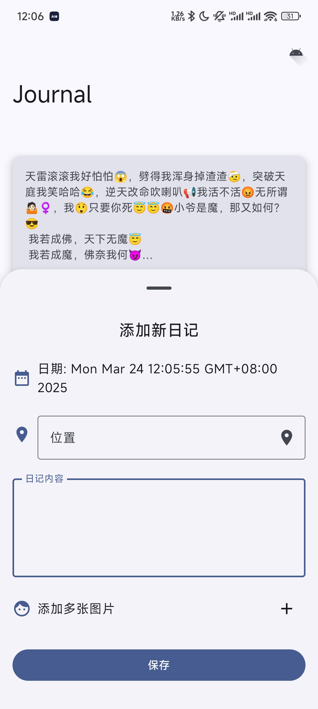
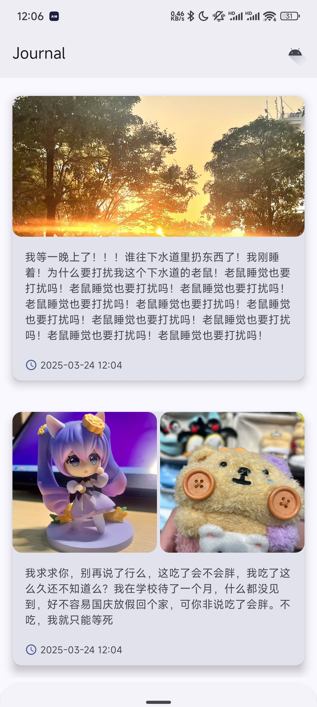

# Journal - Android 日记应用

[English](README.md) | 简体中文

## 概述

Journal 是一款基于 Jetpack Compose 构建的现代 Android
日记应用，让用户能够创建、管理和组织个人日记条目。该应用提供了一个简洁、直观的界面，用于记录日常想法、附加图片和标记位置以保存珍贵回忆。

## 界面预览

<table>

</table>
## 功能特性

### 核心功能

- **日记条目**：创建和管理文本形式的日记条目
- **图片附件**：为每个日记条目添加多张图片
- **位置标记**：自动或手动为条目添加位置信息
- **日期选择**：为日记条目选择自定义日期
- **书签系统**：标记收藏条目以便快速访问
- **滑动操作**：直观的滑动手势用于标记和删除条目

### 用户体验

- **现代界面**：完全基于 Jetpack Compose 构建的流畅、现代界面
- **懒加载**：支持分页的高效日记条目加载
- **流畅动画**：精心设计的卡片交互和过渡动画
- **底部表单**：通过可展开的底部表单便捷创建条目
- **提示消息**：支持操作的用户友好反馈提示

## 架构

应用采用清晰的关注点分离的整洁架构方案：

### 组件

- **UI 层**：基于 Compose 的 UI 组件和界面
- **数据层**：用于持久化存储的 Room 数据库
- **仓库模式**：数据源和 UI 之间的抽象层
- **工具类**：用于权限、位置和图片处理的辅助类

### 关键类

- `JournalData`：表示日记条目的核心数据模型
- `JournalDataSource`：支持分页的自定义数据源实现
- `JournalDatabase`：用于数据持久化的 Room 数据库实现
- `MainScreen`：主要 UI 容器和导航中心
- `CustomLazyCardList`：自定义实现的懒加载列表

## 技术栈

### 核心库

- **Jetpack Compose**：现代 Android UI 开发工具包
- **Room**：用于本地数据持久化的 SQLite 对象映射库
- **Coil**：为 Compose 优化的图片加载库
- **高德地图定位服务**：位置服务集成
- **Kotlin 协程**：异步编程

### 开发环境

- Kotlin 1.9+
- Android SDK 35 (Android 15)
- 最低支持 SDK 29 (Android 10)
- 使用 Kotlin DSL 的 Gradle

## 开始使用

### 前置要求

- Android Studio Iguana (2023.2.1) 或更新版本
- JDK 21

### 安装

1. 克隆仓库
2. 在 Android Studio 中打开项目
3. 同步 Gradle 文件
4. 在模拟器或实体设备上运行应用

### 配置

要使用位置功能，您需要配置高德地图 API：

1. 从[高德开发者控制台](https://lbs.amap.com/)获取 API 密钥
2. 在 AndroidManifest.xml 中取消注释并更新 API 密钥

## 许可证

本项目基于 MIT 许可证 - 详见 [LICENSE](LICENSE) 文件。

## 致谢

- 图标来自 Material Design
- 包含用于测试目的的示例图片